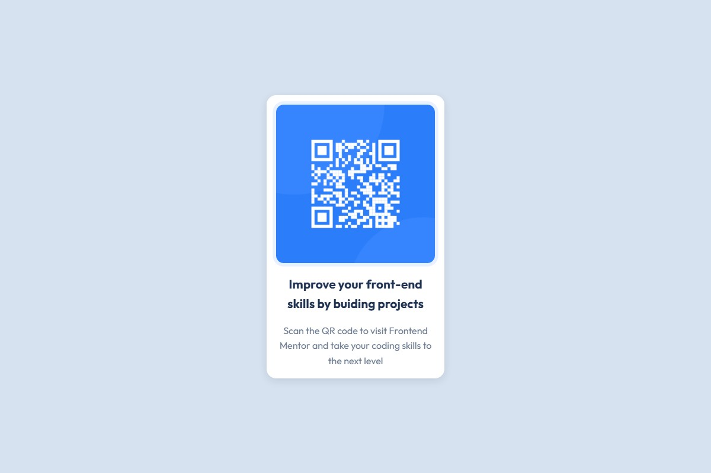

# Frontend Mentor - QR code component solution

This is a solution to the [QR code component challenge on Frontend Mentor](https://www.frontendmentor.io/challenges/qr-code-component-iux_sIO_H). Frontend Mentor challenges help you improve your coding skills by building realistic projects.

## Table of contents

- [Overview](#overview)
  - [Screenshot](#screenshot)
  - [Links](#links)
- [My process](#my-process)
  - [Built with](#built-with)
  - [What I learned](#what-i-learned)
  - [Continued development](#continued-development)
  - [Useful resources](#useful-resources)
  - [AI Collaboration](#ai-collaboration)
- [Author](#author)

## Overview

### Screenshot



### Links

- Solution URL: [github.com/RilayCode/qr-code-challenge](https://github.com/RilayCode/qr-code-challenge)
- Live Site URL: [Ajouter l'URL une fois le site déployé (GitHub Pages / Netlify / Vercel)](https://your-live-site-url.com)

## My process

### Built with

- Semantic HTML5 markup
- SCSS (compiled to CSS)
- Flexbox for layout
- CSS custom properties, used as a bridge between JavaScript and CSS for live-updated values
- CSS keyframe animations & transitions
- Vanilla JavaScript (ES6+) for the interactive layer
- Mobile-first, fluid single-card layout (no breakpoints needed at this size)

### What I learned

Le point de départ de ce projet était une animation "machine à écrire" cassée : le titre et le paragraphe utilisaient `animation: width 0 → 100%` avec `white-space: normal`. Ça marche très bien pour du texte sur une seule ligne, mais dès que le texte passe à la ligne, la boîte qui s'élargit provoque une réorganisation du texte en plein milieu de l'animation - visuellement, ça "explose". J'ai remplacé cette approche par un vrai effet machine à écrire piloté en JavaScript (caractère par caractère), qui ne dépend plus du retour à la ligne.

```js
const typeText = (el, text, speed) => new Promise((resolve) => {
  el.textContent = '';
  let i = 0;
  const tick = () => {
    if (i < text.length) {
      el.append(text[i]);
      i += 1;
      setTimeout(tick, speed);
    } else {
      resolve();
    }
  };
  tick();
});
```

J'ai aussi découvert comment faire communiquer JS et CSS proprement grâce aux **custom properties** : plutôt que de manipuler `element.style.transform` directement en JS (ce qui écrase toute transition CSS), j'expose des variables (`--rx`, `--ry`, `--lift`) que je mets à jour depuis le JS, et c'est le CSS qui décide comment les interpréter et les transitionner. Ça garde une séparation nette entre "le JS pilote la donnée" et "le CSS pilote le rendu".

Enfin, j'ai appris à toujours prévoir un chemin de repli pour l'accessibilité avec `prefers-reduced-motion`, et à éviter les pièges classiques du "flash of unstyled content" en scindant les styles entre `.no-js` et `.js` (une classe basculée en tout début de `<head>`), pour que le contenu reste visible même si le JavaScript ne se charge pas.

### Continued development

- Explorer une vraie interaction "scan" (ex: passer le QR code dans une lightbox agrandie au clic, plutôt qu'un simple effet ripple)
- Approfondir les animations pilotées par `requestAnimationFrame` pour un contrôle plus fin que `setTimeout`
- Tester l'accessibilité clavier/lecteur d'écran de façon plus poussée sur des composants interactifs similaires

### Useful resources

- [MDN - prefers-reduced-motion](https://developer.mozilla.org/en-US/docs/Web/CSS/@media/prefers-reduced-motion) - pour comprendre comment respecter les préférences d'accessibilité liées au mouvement.
- [MDN - Using CSS custom properties](https://developer.mozilla.org/en-US/docs/Web/CSS/Using_CSS_custom_properties) - la référence pour bien comprendre comment lier JS et CSS via des variables.
- [MDN - Pointer events](https://developer.mozilla.org/en-US/docs/Web/API/Pointer_events) - utilisé pour l'effet de tilt 3D et le ripple au clic, unifié souris/tactile.

### AI Collaboration

J'ai utilisé Claude Code (Anthropic) sur la phase de finition du projet, une fois le HTML/CSS du challenge terminé par mes soins.

- **Ce que j'ai fait avec l'IA** : diagnostiquer et corriger l'animation "machine à écrire" cassée, ajouter une couche d'interactions JS (typewriter, tilt 3D au survol, effet ripple au clic, halo pulsant sur le QR code), et rédiger ce README.
- **Ce qui a bien fonctionné** : l'IA a d'abord cherché à me faire diagnostiquer le bug moi-même (le fichier `AGENTS.md` du projet la configure en mode mentor) avant que je clarifie que le codage du challenge était terminé et que je voulais son aide directe pour la partie créative/finition.
- **Point d'attention** : toujours vérifier ce que l'IA écrit avant de le garder - dans mon cas, les animations ont été testées dans un vrai navigateur (Playwright) avant d'être validées, y compris le repli en cas de `prefers-reduced-motion`.

## Author

- GitHub - [@RilayCode](https://github.com/RilayCode)
